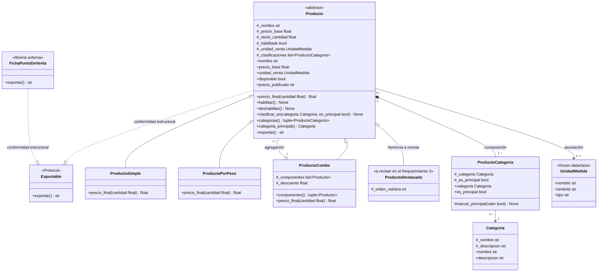

**TECNICATURA UNIVERSITARIA**

**EN PROGRAMACION**

**PROGRAMACIÓN IV**

**Primera Evaluación Parcial**

> *Tecnicatura Universitaria en Programación — Modalidad a distancia — Resolución individual*

# 1. OBJETIVO

Demostrar el dominio práctico de la Unidad 3 sobre un modelo prediseñado, enfocándose en la toma de decisiones de diseño y su fundamentación:

**Encapsulamiento:** proteger el estado interno validando el dominio y decidiendo cuándo se justifica realmente exponer un atributo mediante una *property*.

**Relaciones estructurales:** distinguir y elegir entre composición, agregación y asociación según el ciclo de vida de los objetos.

**Herencia:** decidir cuándo la herencia expresa correctamente una afirmación estricta del dominio («es-un»). **Contratos:** reconocer qué herramienta de contrato es viable (ABC o Protocol) según quién sea el dueño de las clases que deben cumplirlo.

# 2. CONTEXTO DEL DOMINIO

Food Store es un comercio que necesita informatizar su catálogo. Vende productos por pieza (una botella, un paquete), productos por peso (fiambres, verdura) y combos que agrupan productos ya existentes con un descuento. Cada producto se clasifica en una o más categorías (Bebidas, Gaseosas, Fiambrería) y una de esas clasificaciones es la principal: la que determina dónde aparece el producto en el menú.

El sistema de caja del local ya existe y lo provee un tercero. Ese sistema genera sus propias fichas de punto de venta y no se puede modificar, pero el catálogo debe poder exportarse en una sola operación incluyendo tanto los productos propios como esas fichas externas.

> *No se pide persistencia, base de datos, API ni interfaz gráfica. El modelo vive en memoria durante la ejecución. Los identificadores pueden resolverse como un atributo simple o directamente omitirse: el foco está en el diseño de clases.*

# 3. MODELO DE PARTIDA

El diagrama de clases es el punto de partida y se entrega completo: clases, atributos, métodos, relaciones y multiplicidades. Tu trabajo es implementarlo en Python y volver a entregarlo reflejando la decisión del Requerimiento 3.

1

Programación IV

**TECNICATURA UNIVERSITARIA**

**EN PROGRAMACION**

## 3.1 Clases del modelo

| Clase&nbsp; | Rol en el modelo |
| ----- | :---- |
| Producto&nbsp; | Clase abstracta (ABC) del catálogo: nombre, precio base, stock y habilitación. Declara precio_final(cantidad) como método abstracto. |
| ProductoSimple&nbsp; | Se vende por pieza: el precio final es el precio base por la cantidad. |
| ProductoPorPeso&nbsp; | Se vende por peso: el precio base es por unidad de masa y la cantidad admite decimales. |
| ProductoCombo&nbsp; | Agrupa entre 2 y N productos ya construidos y aplica un descuento sobre la suma. |
| ProductoDestacado&nbsp; | Aparece en el diagrama como subclase de Producto. Su lugar en la jerarquía se decide en el Requerimiento 3. |
| Categoria&nbsp; | Agrupa productos del catálogo. Es la categoría a la que apunta cada vínculo de clasificación. |
| ProductoCategoria&nbsp; | Vínculo entre un producto y una categoría, con el atributo propio es_principal. |
| UnidadMedida&nbsp; | Objeto de datos inmutable (kg, g, L, u). No muta en runtime. |
| Exportable&nbsp; | Contrato estructural (Protocol) con exportar() -\> str. |
| FichaPuntoDeVenta&nbsp; | Clase de un tercero, en libreria_externa.py. No hereda de nada tuyo y no se modifica. |


## 3.2 Diagrama de clases (Mermaid)

Copiá el bloque completo y pegalo en https://mermaid.live para verlo renderizado. También podés reproducirlo en UMLetino o en el editor UML que uses.

2

Programación IV

**TECNICATURA UNIVERSITARIA**

**EN PROGRAMACION**



> *ProductoDestacado aparece heredando de Producto y marcada «a revisar»: así viene dibujada en el diagrama que se te entrega, no es la solución. Esa herencia es lo que tenés que resolver en el Requerimiento 3.*

> *Las dos realizaciones de Exportable representan conformidad estructural: tanto Producto como FichaPuntoDeVenta cumplen el contrato porque tienen el método, no porque lo declaren. En el código no se hereda de Exportable —ni en tus clases ni, obviamente, en la ficha—: el Protocol aparece una sola vez, como anotación de tipo en la firma de exportar_catalogo (Requerimiento 4).*

## 3.3 Material que se te entrega

| Archivo&nbsp; | Qué es&nbsp; | ¿Se modifica? |
| ----- | :---- | ----- |
| libreria_externa.py&nbsp; | Clase FichaPuntoDeVenta de un tercero: no hereda de nada tuyo.&nbsp; | No. Nunca. |


No hay código de partida: salvo libreria_externa.py, todo el proyecto lo escribís vos desde cero. El punto de partida es el diagrama de la sección 3.2.

> *libreria_externa.py se entrega y no se modifica nunca. Si tu solución necesita tocarla, la solución está mal: ese es justamente el caso que el Requerimiento 4 pone a prueba. En caso de modificación de libreria_externa.py, HU-P1-04 se califica con 0 puntos (sección 8).*

4

Programación IV

**TECNICATURA UNIVERSITARIA**

**EN PROGRAMACION**

# 4. REQUERIMIENTOS OBLIGATORIOS

Los cinco requerimientos suman 100 puntos. El puntaje de cada uno figura en su título y se resume en la tabla de la sección 8.

## Requerimiento 1 — Modelado del dominio y encapsulamiento (20 pts)

Implementar las clases del diagrama en catalogo.py (un solo módulo, en la raíz del proyecto), respetando:

UnidadMedida como @dataclass(frozen=True).

Atributos internos con guion bajo simple, no con doble guion bajo.

Validaciones de dominio en la construcción: nombre no vacío, precio_base \>= 0 y stock_cantidad \>= 0. Si no se cumplen, se lanza una excepción de dominio. Podés usar ValueError directamente o definir tu propia clase de excepción; **si definís la tuya, tiene que heredar de ValueError**, para que quien atrape ValueError siga funcionando.

@property donde exista lógica que la justifique: estado derivado o formateado (disponible,

precio_publicado), o exposición de solo lectura sin setter (nombre, precio_base). Resta puntaje el par getter \+ setter sin validación, que expone el atributo como si fuera público.

### Properties que deben estar implementadas

| Property&nbsp; | Qué devuelve |
| :---- | :---- |
| precio_publicado&nbsp; | "$ 12.50 / kg" cuando el producto tiene unidad de venta —se muestra el símbolo de la UnidadMedida—; "$ 3.00" cuando la unidad es None. |
| disponible&nbsp; | True solo si el producto está habilitado y stock_cantidad \> 0. |


> *UnidadMedida.tipo («masa», «volumen», «unidad») es dato descriptivo del catálogo: ninguna regla de este parcial lo consulta.*

### Además de las properties:

Producto expone habilitar() y deshabilitar(), que son la única vía para cambiar _habilitado. Sin ellas, el criterio de disponible sobre la habilitación no se puede demostrar en el demo.

Categoria recibe nombre y, opcionalmente, descripcion (cadena vacía por defecto); las dos se exponen como properties de solo lectura. Ninguna regla de este parcial consulta la descripción: es dato de catálogo. La unidad de venta se lee con la property unidad_venta, que devuelve la UnidadMedida o None.

## Requerimiento 2 — Relaciones estructurales del catálogo (25 pts)

Implementar las tres relaciones estructurales del diagrama. Cada una debe distinguirse por dos cosas observables en el código: cómo se obtiene la parte —la fabrica el todo o se recibe ya construida— y quién es su dueño, es decir si la parte puede existir por su cuenta o solo tiene sentido dentro del todo.

**Composición —** Producto y ProductoCategoria (1 a 1..*). El vínculo lo fabrica el propio Producto mediante clasificar_en(categoria, es_principal=False). El código cliente nunca lo instancia.

5

Programación IV

**TECNICATURA UNIVERSITARIA**

**EN PROGRAMACION**

**Agregación —** ProductoCombo y sus componentes (1 a 2..*). Se reciben ya construidos y existen antes y después del combo.

**Asociación 0..1 —** Producto y UnidadMedida. Un producto sin unidad de venta es válido; la unidad existe con independencia del producto.

**Además:**

Retorno protegido en las dos multiplicidades *: categorias() y componentes() devuelven una tupla construida a partir de la lista interna, nunca la lista interna. El retorno es a la vez copia e inmutable. (Es la colección la que se copia: los objetos que contiene son los mismos, y cada uno se protege solo, con sus properties sin setter.)

El constructor de Producto recibe la categoría principal y crea internamente el primer ProductoCategoria con es_principal=True.

clasificar_en(categoria, es_principal=False) agrega clasificaciones adicionales y no devuelve el vínculo: la única vía de acceso desde afuera es categorias(). Si se invoca con es_principal=True, el vínculo que era principal pasa a es_principal=False.

**El vínculo no expone setter.** es_principal es una property de lectura y nadie asigna _es_principal desde afuera.

**Invariante de la clasificación:** un producto tiene, en todo momento, **exactamente una** clasificación principal — ni cero ni dos—. Lo garantiza el Producto, que es el dueño de la composición: el código cliente cambia la principal volviendo a clasificar con es_principal=True, nunca tocando el vínculo. Cómo reordena el producto sus vínculos es decisión tuya: un método de dominio en ProductoCategoria que solo invoca su producto dueño —por eso en el diagrama va como protegido, \#marcar_principal(valor)— o reemplazar el vínculo por uno nuevo, si lo modelaste inmutable. Se justifica en el video.

categoria_principal() devuelve la Categoria principal, no el vínculo: la única vía de acceso a los vínculos sigue siendo categorias().

Clasificar dos veces en la misma categoría lanza una excepción de dominio.

## Requerimiento 3 — Herencia justificada por dominio (25 pts)

1. Declarar Producto como clase abstracta (ABC) con @abstractmethod precio_final(cantidad). Todas las subclases respetan ese nombre de parámetro.

2. Implementar las tres subclases de venta con las reglas de cálculo de la tabla siguiente.

3. Analizar la pertinencia de la herencia de ProductoDestacado y resolver la decisión que el diagrama deja abierta.

### Reglas de cálculo de precio_final(cantidad)

| Subclase&nbsp; | Fórmula&nbsp; | Validación de la cantidad |
| ----- | :---- | :---- |
| ProductoSimple&nbsp; | precio_base × cantidad&nbsp; | De valor entero y \>= 1 (3 y 3.0 son válidos; 2.5 no). Si no lo es, excepción de dominio. |


6

Programación IV

**TECNICATURA UNIVERSITARIA**

**EN PROGRAMACION**

| Subclase&nbsp; | Fórmula&nbsp; | Validación de la cantidad |
| ----- | :---- | :---- |
| ProductoPorPeso&nbsp; | precio_base × cantidad, redondeado a 2 decimales | \> 0, admite decimales (0.250 kg es válido). |
| ProductoCombo&nbsp; | (suma de componente.precio_final(1)) × (1 − descuento) × cantidad | De valor entero y \>= 1 (3 y 3.0 son válidos; 2.5 no). El descuento se fija al construir y debe estar en \[0, 1). **Menos de 2 componentes lanza excepción de dominio.** |


> *Solo ProductoPorPeso redondea. En las otras dos, el resultado es el float que sale de la fórmula: la corrección compara sobre precio_publicado —que ya formatea con :.2f— o con tolerancia, no exigiendo una igualdad exacta de float.*

> *Un combo puede recibir cualquier Producto como componente, incluido otro combo. Si armás combos anidados, tené presente que el precio_final(1) de un componente-combo ya trae su propio descuento aplicado.*

### Decisión obligatoria: ProductoDestacado

En el diagrama, ProductoDestacado se modeló como subclase de Producto. Analizá la pertinencia de esa herencia y decidí, aplicando el criterio «es-un» del dominio, si se mantiene o se rediseña. Tu decisión tiene que quedar implementada en el código.

**Si la mantenés**, tenés que resolver además dos cosas que el diagrama no trae, y justificar las dos: qué regla de precio_final(cantidad) tiene un producto destacado (la tabla de arriba no la define), y cómo se destaca un producto por peso o un combo si la clase ya heredó de Producto.

**Si la rediseñás**, mostrá con qué reemplazás la herencia, dónde vive _orden_vidriera y qué productos del catálogo pueden destacarse con tu diseño.

Esta decisión se evalúa con la HU-P1-05 y vale 10 de los 25 puntos del Requerimiento 3; los 15 restantes corresponden a la HU-P1-03. Se califica la fundamentación y la coherencia entre diagrama, código y defensa.

**Falla temprana:** instanciar la clase abstracta, o una subclase que no implemente precio_final(), debe fallar al construir, no al usar. Eso se demuestra en main.py; podés definir esa subclase incompleta dentro de main.py, al solo efecto de la demostración.

No debe haber if/elif ni isinstance() por tipo de producto en el código cliente: el cálculo lo resuelve el polimorfismo. Lo prohibido es preguntar **cuál** de las subclases de Producto es algo para calcular distinto según la respuesta. Validar que un argumento sea del tipo que la firma declara —que cantidad sea numérica y de valor entero, que categoria sea una Categoria, que un componente de combo sea un Producto— es correcto y no cuenta como ramificar por tipo.

> *El diagrama no define qué es el precio_base de un ProductoCombo, que lo hereda de Producto: decidí si lo recibís como dato de catálogo o lo derivás de sus componentes, e implementalo de forma coherente con precio_publicado. Lo mismo vale para su stock_cantidad —y por lo tanto para disponible—: decidí si un combo tiene stock propio o si su disponibilidad se deriva de la de sus componentes, y dejalo explicado.*

7

Programación IV

**TECNICATURA UNIVERSITARIA**

**EN PROGRAMACION**

## Requerimiento 4 — Contratos: ABC vs. Protocol (15 pts)

Definí el contrato Exportable con exportar() -\> str. Deben cumplirlo:

Las clases de tu dominio (Producto y sus subclases).

FichaPuntoDeVenta, la clase de libreria_externa.py: ya tiene el método, pero no hereda de nada tuyo y no la podés modificar.

```python
# libreria_externa.py — SE ENTREGA. NO SE MODIFICA.

class FichaPuntoDeVenta:

    """Ficha que genera el sistema de caja de un tercero."""

    def __init__(self, codigo: str, detalle: str) -> None:

        self._codigo = codigo

        self._detalle = detalle

    def exportar(self) -> str:

        return f"POS|{self._codigo}|{self._detalle}"
```

### Se pide:

1. Implementar el contrato como Protocol. Ninguna de tus clases hereda de él: lo cumplen por tener el método (ver la nota del diagrama en §3.2).

2. Escribir una función exportar_catalogo(items: list\[Exportable\]) -\> list\[str\] que reciba productos y fichas de punto de venta en la misma lista y funcione en runtime con ambos tipos. El contenido de la cadena que devuelve Producto.exportar() es de diseño libre: se evalúa que devuelva str y que la exportación funcione con ambos tipos, no su formato.

> *No hace falta @runtime_checkable: exportar_catalogo() no necesita ningún isinstance. Si lo usás igual, no resta.* **Requerimiento 5 — Diagrama UML final y demo ejecutable (15 pts)**

### Diagrama — uml/modelo_final.md

Tu versión del diagrama de clases que se te entregó, reflejando la decisión del Requerimiento 3. Se acepta código Mermaid (texto, en el .md) o una imagen .png exportada desde UMLetino o el editor UML que uses; si entregás una imagen, va dentro de uml/ y referenciada desde modelo_final.md. Debe mostrar herencia, composición (*- -), agregación (o--), asociación (--\>), la conformidad con el Protocol (..|\>) y todas las multiplicidades.

El diagrama muestra las clases del modelo con sus atributos, sus métodos públicos y sus relaciones. No hace falta diagramar las clases de excepción ni las funciones sueltas como exportar_catalogo().

> *Si tu diagrama no coincide con tu código, el que vale es el código, y la incoherencia resta puntaje dentro de los 15 puntos de este requerimiento.*

8

Programación IV

**TECNICATURA UNIVERSITARIA**

**EN PROGRAMACION**

### Demo ejecutable — main.py

Un script que arme un catálogo con al menos 4 productos —sin contar los componentes de un combo—, cubriendo las tres subclases de venta (ProductoSimple, ProductoPorPeso y ProductoCombo), los clasifique en categorías, asigne unidades de venta distintas, calcule precios finales con cantidades distintas, exporte todo junto con una FichaPuntoDeVenta y muestre el catálogo por consola.

Aprovechá el demo para dejar a la vista las decisiones de diseño:

que un ProductoCategoria **solo puede nacer dentro** del producto que lo clasifica —el código cliente no lo construye, no lo recibe de clasificar_en() y no puede reemplazarlo— (**composición**);

que los componentes **sí sobreviven** al combo, y se los puede volver a agrupar en otro (**agregación**); que instanciar un Producto abstracto sin precio_final() revienta al construir (**falla temprana**).

# 5. ESTRUCTURA DEL PROYECTO

El código debe ubicarse en la raíz del proyecto respetando esta organización.

```text
Apellido_Nombre_P1_POO/

├── README.md # qué resuelve cada archivo y cómo se ejecuta

├── catalogo.py # dominio completo (Req. 1 a 4)

├── libreria_externa.py # se entrega, SIN MODIFICAR

├── main.py # demo ejecutable del catálogo (Req. 5)

├── link_video.txt # link al video de defensa (sección 6.3)

└── uml/

└── modelo_final.md # diagrama Mermaid, o .png referenciado desde acá (Req. 5)
```

# 6. CONDICIONES DE ENTREGA

El parcial se resuelve de forma individual: cada estudiante escribe y entrega su propio proyecto, y defiende su propio código en el video de la sección 6.3.

## 6.1 Requisitos técnicos

El desarrollo debe realizarse exclusivamente con Python 3.12 o superior y su biblioteca estándar: abc, typing, dataclasses, entre otros módulos estándar que necesites.

Los precios se manejan con float y se formatean con f-strings (f"$ {precio:.2f}").

No se permite el uso de ORMs (SQLAlchemy, Django ORM, Peewee) ni de frameworks web (FastAPI, Flask, Django).

No se utiliza base de datos: el modelo vive en memoria durante la ejecución.

No se requiere ninguna dependencia externa: el proyecto debe correr con un intérprete de Python 3.12 limpio, sin entorno virtual armado y sin instalar paquetes (python main.py).

Type hints obligatorios en toda firma pública. Se respeta PEP 8.

Se debe respetar la estructura del proyecto indicada en la sección 5.

9

Programación IV

**TECNICATURA UNIVERSITARIA**

**EN PROGRAMACION**

## 6.2 Código

El código debe estar en un único archivo .zip que contenga la carpeta de la sección 5, con el archivo link_video.txt dentro de esa carpeta, conteniendo el link al video.

Nombre del archivo: Apellido_Nombre_P1_POO.zip.

El proyecto debe ser funcional y ejecutable.

Debe incluir un README.md con la descripción breve del proyecto y las instrucciones para ejecutarlo. Si trabajaste con entorno virtual o ejecutaste el proyecto, antes de comprimir eliminá __pycache__/ y .venv/. No se modifica libreria_externa.py en ninguna línea.

## 6.3 Video de defensa (obligatorio)

La entrega sin video se considera incompleta y no se corrige.

| Aspecto&nbsp; | Requisito |
| :---- | :---- |
| Duración&nbsp; | Entre 10 y 15 minutos |
| Cámara&nbsp; | Encendida durante toda la exposición |
| Audio&nbsp; | Claro y comprensible |
| Pantalla&nbsp; | Compartida al mostrar la ejecución y el código |


### Contenido del video

1. Presentarte brevemente.

2. Mostrar en pantalla la demo de main.py corriendo.

3. Responder, sobre tu propio código y en este orden, las siguientes preguntas:

| \#&nbsp; | Pregunta&nbsp; | Req. |
| :---: | :---- | :---- |
| 1&nbsp; | Composición, agregación y asociación se escriben casi igual en Python. ¿Qué mirás en tu propio código para saber cuál implementaste, si la sintaxis no te lo dice? Respondé para las tres relaciones, señalando la línea exacta que lo delata y qué le pasa a la parte cuando el todo deja de existir. | R2 |
| 2&nbsp; | ¿ProductoDestacado se queda como subclase o se rediseña? Justificá con el criterio «es-un» del dominio y mostrá con qué la reemplazaste si la sacaste. | R3 |
| 3&nbsp; | El enunciado pide resolver Exportable con Protocol. ¿Qué pasaría exactamente si intentaras resolverlo con una ABC sin tocar la librería externa? ¿Y por qué para Producto sí serviría una ABC? | R4 |
| 4&nbsp; | ¿Qué parte del modelo implementaste tal cual estaba en el diagrama, y qué parte tuviste que resolver con una decisión que el diagrama no dice? | Todos |


10

Programación IV

**TECNICATURA UNIVERSITARIA**

**EN PROGRAMACION**

> *Las decisiones que se defienden en el video deben verse en el código: una justificación sin correlato en la implementación no se considera lograda.*

# 7. HISTORIAS DE USUARIO DE REFERENCIA

# HU-P1-01: Registrar un producto con su unidad de venta

**Como** responsable del catálogo de Food Store, **quiero** registrar un producto indicando su precio base y la unidad en la que se vende, **para** que el precio publicado sea inequívoco para el cliente.

### Criterios de aceptación

Al construir un producto se valida que nombre no esté vacío, precio_base \>= 0 y stock_cantidad \>= 0; si no, se lanza una excepción de dominio (ValueError o una subclase suya).

La unidad de venta es opcional (0..1): un producto sin unidad es válido.

El precio se muestra como "$ 12.50 / kg" cuando hay unidad —usando el símbolo— y como "$ 3.00" cuando no la hay.

disponible es True solo si el producto está habilitado y su stock es mayor que cero. Existe una vía para deshabilitar y volver a habilitar un producto, y el demo muestra el efecto sobre disponible.

UnidadMedida es inmutable: intentar reasignar simbolo lanza FrozenInstanceError.

Categoria se construye con su nombre y, si se quiere, una descripcion; las dos se leen por property y ninguna tiene setter.

# HU-P1-02: Clasificar un producto en categorías

**Como** responsable del catálogo de Food Store, **quiero** asociar cada producto a una o más categorías marcando una como principal, **para** que el producto aparezca en el lugar correcto del menú.

### Criterios de aceptación

El constructor de Producto recibe la categoría principal y crea internamente el primer vínculo con es_principal=True.

Producto expone clasificar_en(categoria, es_principal=False), que construye internamente el vínculo ProductoCategoria.

El vínculo no se construye desde el código cliente ni lo devuelve clasificar_en(): la única vía de acceso es categorias(), y los datos del vínculo se leen sin setters —es_principal no es asignable—.

Después de cualquier secuencia de clasificaciones, el producto tiene **exactamente una** principal: ni cero ni dos. Marcar una nueva clasificación como principal desmarca la anterior, y el código cliente no tiene forma de romper ese invariante desde afuera.

Clasificar dos veces en la misma categoría lanza una excepción de dominio.

categorias() devuelve una tupla construida a partir de la lista interna: no es la lista interna, y append sobre el retorno lanza AttributeError.

11

Programación IV

**TECNICATURA UNIVERSITARIA**

**EN PROGRAMACION**

# HU-P1-03: Calcular el precio final según el tipo de producto

**Como** cajero de Food Store, **quiero** que cada tipo de producto calcule su precio final con su propia regla, **para** cobrar correctamente sin escribir condicionales por tipo.

### Criterios de aceptación

Producto declara precio_final(cantidad) como @abstractmethod y todas las subclases respetan el nombre del parámetro.

Las tres subclases aplican las reglas de la tabla del Requerimiento 3, con sus validaciones de cantidad. ProductoCombo recibe sus componentes ya construidos (2..*) —menos de dos lanza excepción de dominio—, con un descuento en \[0, 1), y componentes() devuelve una tupla, no la lista interna.

El código cliente no contiene if/elif ni isinstance() por tipo de producto: resuelve por polimorfismo. Instanciar la clase abstracta o una subclase incompleta lanza TypeError al construir, no al usar.

# HU-P1-04: Exportar el catálogo completo al punto de venta

**Como** responsable del catálogo de Food Store, **quiero** exportar en una sola operación tanto los productos del sistema como las fichas que genera la librería de terceros, **para** enviar el catálogo completo al sistema de caja sin adaptaciones manuales.

### Criterios de aceptación

Existe un contrato Exportable con exportar() -\> str, resuelto como Protocol.

Ninguna clase del dominio hereda de Exportable: la conformidad es estructural.

exportar_catalogo(items) acepta en la misma lista productos y objetos FichaPuntoDeVenta, y funciona en runtime con ambos.

libreria_externa.py no se modifica en ninguna línea.

La firma está declarada como list\[Exportable\] -\> list\[str\].

# HU-P1-05: Decidir la pertinencia de la herencia de ProductoDestacado

**Como** responsable del catálogo de Food Store, **quiero** destacar productos en la vidriera indicando su orden de aparición, **para** promocionarlos sin forzar el modelo del catálogo.

### Criterios de aceptación

La decisión sobre ProductoDestacado está implementada en el código, no solamente justificada en el video: se puede señalar la clase, el atributo o la relación que la materializa.

Si se mantiene la herencia, se justifica con el criterio «es-un» del dominio, ProductoDestacado cumple el contrato de Producto —incluida precio_final(cantidad), con una regla explicitada— y se explica cómo se destaca un producto por peso o un combo.

Si se rediseña, queda explícito con qué se reemplaza la herencia y dónde vive _orden_vidriera. **En cualquiera de los dos casos**, la decisión deja explícito qué productos del catálogo pueden destacarse, y el costo de esa restricción está justificado.

12

Programación IV

**TECNICATURA UNIVERSITARIA**

**EN PROGRAMACION**

El diagrama de uml/modelo_final.md refleja la decisión tomada y coincide con el código. No se evalúa cuál de las dos decisiones se toma, sino su fundamentación y su coherencia entre diagrama, código y defensa (pregunta 2 de la sección 6.3).

# 8. CRITERIOS DE EVALUACIÓN

| Historia de usuario / Entregable&nbsp; | Req.&nbsp; | Puntos |
| :---- | :---- | :---- |
| HU-P1-01 — Registrar un producto con su unidad de venta&nbsp; | R1&nbsp; | 20 |
| HU-P1-02 — Clasificar un producto en categorías&nbsp; | R2&nbsp; | 25 |
| HU-P1-03 — Calcular el precio final según el tipo de producto&nbsp; | R3&nbsp; | 15 |
| HU-P1-04 — Exportar el catálogo completo al punto de venta&nbsp; | R4&nbsp; | 15 |
| HU-P1-05 — Decidir la pertinencia de la herencia de ProductoDestacado&nbsp; | R3&nbsp; | 10 |
| Diagrama UML final y demo ejecutable&nbsp; | R5&nbsp; | 15 |
| **TOTAL**&nbsp; |  | **100** |
| **Mínimo para aprobar**&nbsp; |  | **60** |


Cada incumplimiento se descuenta una sola vez, en el requerimiento donde se manifiesta. No se aplican descuentos adicionales por el mismo motivo. La nota final nunca es menor a 0.

Si el proyecto no se ejecuta, los requerimientos cuya evidencia no pueda observarse se califican con 0. No se aplica ningún descuento adicional por este motivo.

Modificar libreria_externa.py implica que HU-P1-04 se califica con 0, es decir 15 puntos menos. No se aplica ningún otro descuento por este motivo.

La entrega sin video de defensa no se corrige.

13

Programación IV
