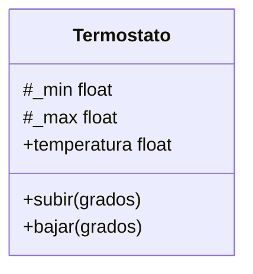
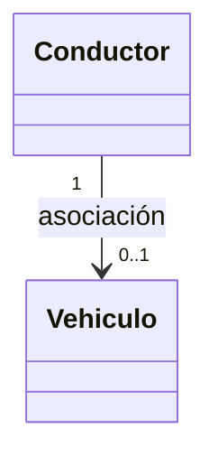
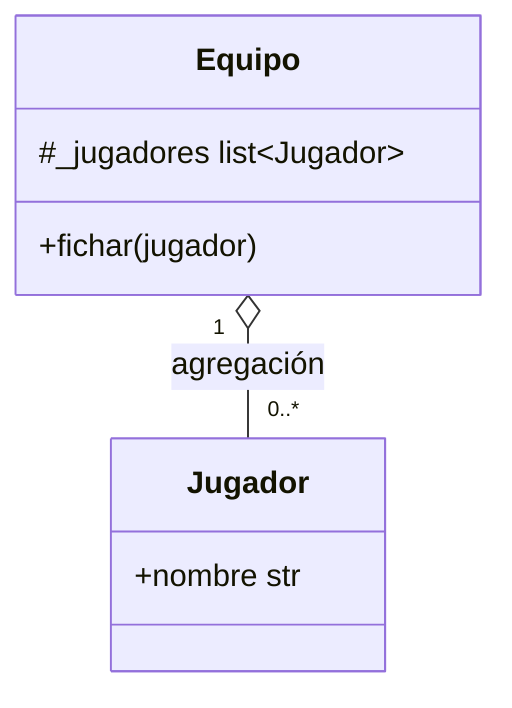
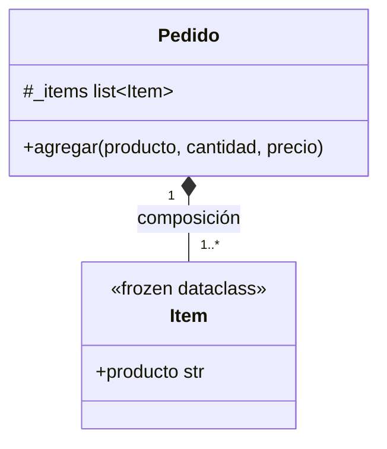
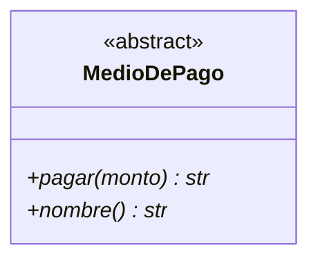
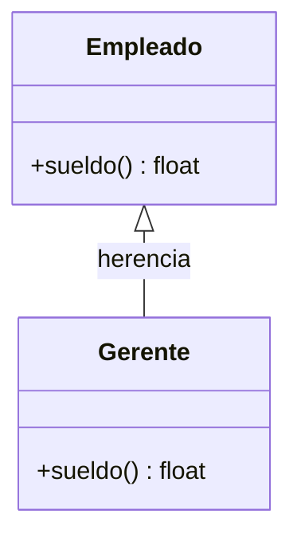
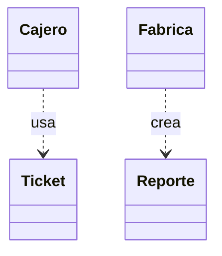
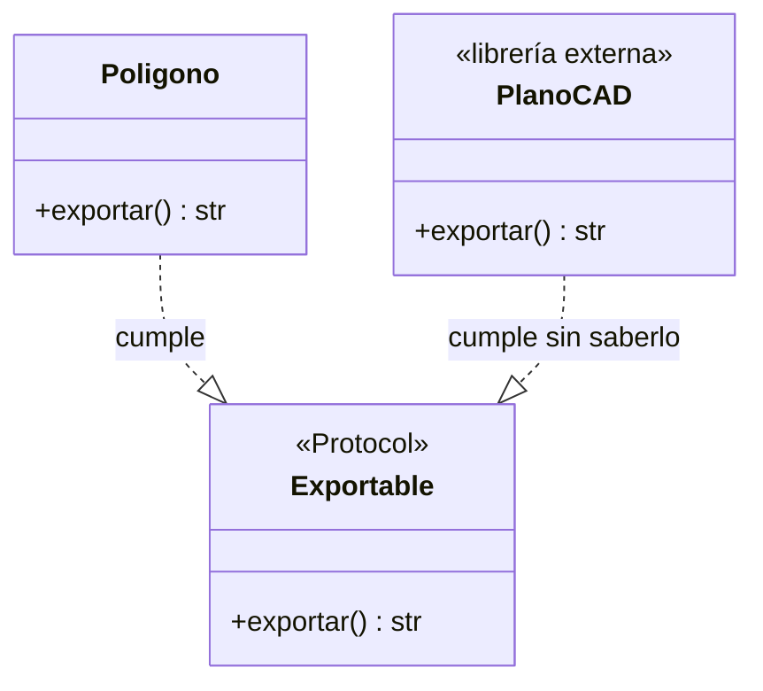

# Cómo hacer Diagramas UML en Python (Mermaid)

Este manual resumido detalla cómo modelar diagramas de clases UML con código Python, usando la sintaxis de **Mermaid**. Combina las reglas conceptuales de relaciones entre clases con las convenciones específicas para que el diagrama refleje fielmente la implementación en Python.

---

## 1. Convenciones y Sintaxis Python en UML

Al modelar código Python, el diagrama se adapta a las particularidades del lenguaje:

*   **Visibilidad (Encapsulamiento):**
    *   Usa el prefijo `#_` para denotar atributos o métodos **protegidos** (convención de Python con un guion bajo, ej. `#_lados`). Combina el `#` de UML protegido con el `_` de Python.
    *   Usa el prefijo `+` para atributos o métodos **públicos** (ej. `+nombre str`).
*   **Estereotipos Especiales:**
    *   `<<abstract>>`: Para clases base abstractas (ABC).
    *   `<<Protocol>>`: Para interfaces estructurales (*duck typing*).
    *   `<<dataclass>>` / `<<frozen dataclass>>`: Para marcar clases de datos simples o inmutables (objetos-valor).
*   **Métodos Abstractos y Miembros de Clase:**
    *   **Métodos abstractos:** Se marcan con un asterisco `*` al final del nombre (ej. `+area()* float`).
    *   **Atributos/Métodos de clase (estáticos):** Se marcan con un signo peso `$` (ej. `+cantidad_creados$ int`, `+desde_medidas()$ Poligono`).
*   **Anotación de Tipos (Type Hinting):**
    *   Para genéricos (como listas o tuplas), Mermaid usa virgulillas `~` en lugar de corchetes angulares. Ejemplo: `list~Lado~`, `tuple~Poligono~`.

---

## 2. Relaciones entre Clases

La diferencia clave entre las relaciones en Python suele estar en el **ciclo de vida**: quién crea el objeto y si este sobrevive o no a la clase que lo contiene.

### 2.1 Clase Única
Modela un concepto autónomo con estado e invariantes. No se vincula con ninguna otra clase.
*   **Python:** Un objeto que valida su propio estado en el constructor (`__init__`).



### 2.2 Asociación
Dos objetos **independientes** que se conocen para colaborar, pero **ninguno es dueño del otro**.
*   **Python (Ciclo de vida):** Cada objeto se crea por separado. La referencia mutua se establece *después* mediante un método (ej. `asignar()`).
*   **Sintaxis Mermaid:** `-->` o `--`.



### 2.3 Agregación
Relación de tipo **"tiene un"**, donde el todo agrupa a las partes, pero **las partes sobreviven si el todo se destruye**.
*   **Python (Ciclo de vida):** El todo **recibe** a la parte ya construida desde el exterior (como parámetro en el `__init__` o mediante un método).
*   **Sintaxis Mermaid:** `o--` (Rombo vacío).



### 2.4 Composición
Relación estructural más fuerte. **"Se compone de"**: las partes no tienen sentido sin el todo y **mueren con él**.
*   **Python (Ciclo de vida):** La parte se **crea directamente adentro del constructor** o métodos del todo. No se recibe ya instanciada.
*   **Sintaxis Mermaid:** `*--` (Rombo lleno).



### 2.5 Clase Abstracta
Un molde incompleto que no se puede instanciar directamente, diseñado para que sus subclases lo completen.
*   **Python:** Hereda de `ABC` y usa decoradores `@abstractmethod`.
*   **Sintaxis Mermaid:** Estereotipo `<<abstract>>` y métodos con `*`.



### 2.6 Herencia
Relación de generalización o **"es un"**. Las subclases especializan el comportamiento sobrescribiendo métodos.
*   **Python:** La subclase llama a `super().__init__(...)` obligatoriamente.
*   **Sintaxis Mermaid:** `<|--` (Triángulo hueco apuntando al padre).



### 2.7 Dependencia (Uso y Creación)
El vínculo más transitorio. Una clase necesita a otra apenas por un instante dentro de un método, **sin guardarla como atributo**.
*   **Python (Uso):** Recibe el objeto por parámetro, lo usa y lo suelta.
*   **Python (Creación):** Instancia el objeto dentro de un método y lo retorna/usa, sin retenerlo en `self`.
*   **Sintaxis Mermaid:** `..>` (Flecha punteada).



### 2.8 Interfaces (ABC pura y Protocol)
Un contrato de capacidades.
*   **ABC (Contrato nominal):** Una interfaz de solo firmas abstractas. La clase que cumple el contrato debe heredar explícitamente.
*   **Protocol (Contrato estructural):** La clase cumple el contrato solo por tener los métodos correspondientes (*duck typing*), sin saber que la interfaz existe.
*   **Sintaxis Mermaid:** Estereotipo `<<Protocol>>` o `<<interface>>` y flecha de implementación `..|>`.



---

## 3. Resumen Final de Relaciones

| Relación | Símbolo UML | Marca en el código Python | Sintaxis Mermaid |
| :--- | :--- | :--- | :--- |
| **Clase Única** | ▭ | Sin referencias a otras clases | `class Nombre` |
| **Asociación** | ───── | Ref mutua, objetos *creados afuera* | `A --> B` |
| **Agregación** | ◇──── | Parte *entra por parámetro* | `A o-- B` |
| **Composición** | ◆──── | Parte *creada en el constructor* | `A *-- B` |
| **Herencia** | ────▷ | `class Sub(Super)` + `super()` | `Super <|-- Sub` |
| **Dependencia** | ┄┄\> | Objeto usado/creado en método, *no guardado* en atributo | `A ..> B` |
| **Interfaz (Nominal)** | ┄┄▷ | `ABC` pura + herencia explícita | `Clase ..|> Interfaz` |
| **Interfaz (Protocol)**| ┄┄▷ | `Protocol`, cumplimiento estructural | `Clase ..|> Interfaz` |

---

## 4. Trucos de Renderizado (Layout) en Mermaid

Los diagramas de clases en Mermaid (`classDiagram`) no permiten posicionar elementos con coordenadas absolutas. El motor gráfico subyacente (Dagre) distribuye los nodos automáticamente basándose casi exclusivamente en la **dirección en la que se escriben las flechas**.

### El truco del Sink Node

A menudo, una Interfaz central o Clase Base (ej. `Report` o `Exportable`) termina renderizándose en el medio del diagrama, rodeada de sus subclases y dependencias, generando un gráfico confuso y superpoblado.

Para forzar al motor a empujar este nodo principal hacia un extremo libre del gráfico (hacia arriba o hacia abajo, aislando la abstracción), **debés invertir la declaración de las relaciones** para que todas las flechas apunten *hacia* esa clase, convirtiéndola visualmente en un "sumidero".

**Código clásico (La abstracción queda atrapada en el medio):**
```mermaid
%% Se lee: "Interfaz es implementada por la Clase"
Interfaz <|.. ClaseConcreta
```

**Código optimizado para Layout (Aísla la abstracción en un extremo):**
```mermaid
%% Se lee: "La Clase implementa la Interfaz"
ClaseConcreta ..|> Interfaz
```

Ambas líneas significan exactamente lo mismo en UML (realización), pero la segunda le da la directiva al motor gráfico de empujar el nodo `Interfaz` hacia afuera, limpiando significativamente la legibilidad de arquitecturas con múltiples implementaciones. Lo mismo aplica para la herencia (`Sub --|> Super` en lugar de `Super <|-- Sub`).