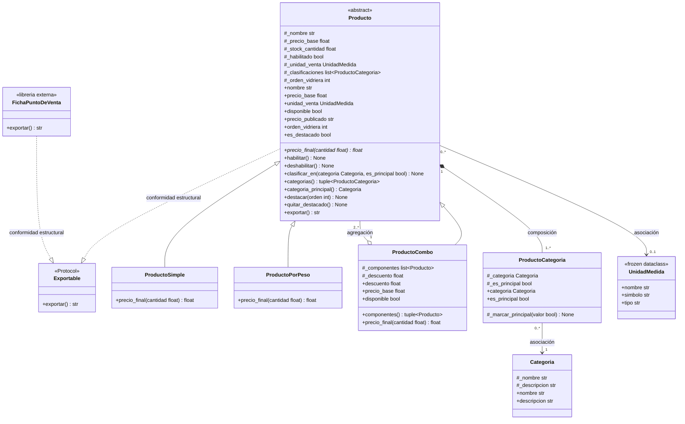
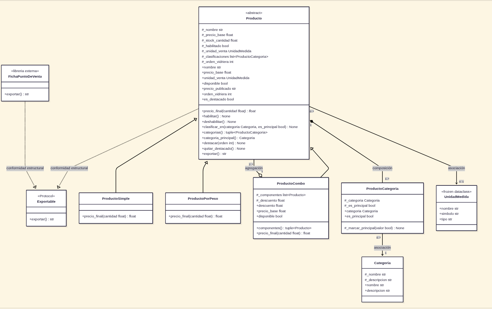

# Diagrama de Clases UML Final - Food Store

Diagrama de clases final que refleja la arquitectura implementada en `catalogo.py` tras resolver las decisiones de diseño de [consignas.md](/docs/consignas.md) y evitando los javaísmos según [javaismos_guia.md](/docs/javaismos_guia.md) y [howto_uml.md](/docs/howto_uml.md), resumen que también está basado en el material teórico que hemos visto en la cursada.

---

## 1. Diagrama de Clases (Mermaid)

> **Renderizado gráfico exportado:**
> 

---

## 2. Explicación de las Relaciones del Modelo

En Python, la sintaxis entre relaciones estructurales suele escribirse de forma muy similar (guardando una referencia o lista en un atributo). El criterio determinante para distinguirlas es el **ciclo de vida**, que indica cómo nace la parte y qué le ocurre cuando el todo deja de existir.

### 2.1 Herencia (`<|--`) — Generalización «es-un»
* **Participantes:** `Producto` hacia `ProductoSimple`, `ProductoPorPeso` y `ProductoCombo`.
* **Fundamentación:** Modela la especialización del catálogo por **modalidad comercial de venta y cálculo de precios**:
  - `ProductoSimple`: venta unitaria entera (`cantidad >= 1`).
  - `ProductoPorPeso`: venta continua a granel con redondeo explícito a 2 decimales (`cantidad > 0`).
  - `ProductoCombo`: venta promocional con descuento aplicado sobre la suma de sus componentes.
* **Marca en el código:** Subclases que heredan de `Producto(ABC)` e implementan el método abstracto `@abstractmethod precio_final(self, cantidad: float) -> float`. En `ProductoSimple` y `ProductoPorPeso` no se redefine `__init__` (herencia idiomática limpia sin boilerplate), mientras que en `ProductoCombo` se redefine invocando `super().__init__(...)` en la primera línea.

### 2.2 Composición (`*--`) — Ciclo de vida dependiente
* **Participantes:** `Producto "1" *-- "1..*" ProductoCategoria`.
* **Multiplicidad:** Un producto posee de 1 a N clasificaciones; cada clasificación pertenece a un único producto.
* **Ciclo de vida:** El vínculo `ProductoCategoria` **nace exclusivamente dentro de `Producto`** (en su `__init__` y en el método `clasificar_en`). El código cliente no puede instanciarlo directamente, no lo recibe de retorno al clasificar y no puede reasignarlo.
* **¿Qué le pasa a la parte si el todo se destruye?:** Si la instancia de `Producto` se elimina de memoria, todos sus objetos `ProductoCategoria` mueren con ella; no tienen sentido ni identidad independiente en el negocio.

### 2.3 Agregación (`o--`) — Ciclo de vida independiente
* **Participantes:** `ProductoCombo "1" o-- "2..*" Producto`.
* **Multiplicidad:** Un combo agrupa entre 2 y N productos preexistentes.
* **Ciclo de vida:** A diferencia de la composición, los componentes **no se crean dentro del combo**. Se reciben ya construidos desde el exterior a través del constructor `__init__(..., componentes, ...)`.
* **¿Qué le pasa a la parte si el todo se destruye?:** Si el combo se desintegra o se elimina (`del combo`), los productos componentes (`cafe`, `medialuna`, etc.) **sobreviven intactos** en el sistema, conservan su precio y disponibilidad, y pueden agruparse en nuevos combos.

### 2.4 Asociación (`-->`) — Colaboración entre independientes
* **Participantes:**
  - `Producto "0..*" --> "0..1" UnidadMedida`
  - `ProductoCategoria "0..*" --> "1" Categoria`
* **Fundamentación:**
  - `UnidadMedida` es un *Value Object* inmutable (`@dataclass(frozen=True)`). Su existencia es totalmente autónoma de los productos. Un producto puede no tener unidad (`None`) y seguir siendo válido.
  - `Categoria` representa un agrupador conceptual de catálogo. Existe antes y después de cualquier producto que se clasifique en ella.

### 2.5 Realización de Protocol (`..|>`) — Conformidad Estructural (Duck Typing)
* **Participantes:** `Producto ..|> Exportable` y `FichaPuntoDeVenta ..|> Exportable`.
* **Fundamentación:** `Exportable` es un `typing.Protocol`.
  - Ni `Producto` ni `FichaPuntoDeVenta` heredan de `Exportable` en su código (no hay tipado nominal `class Producto(Exportable)`).
  - Cumplen el contrato **exclusivamente por poseer el método `exportar(self) -> str`** con la firma adecuada.
  - Esto desacopla el catálogo de la librería de terceros `libreria_externa.py` (que nunca se modifica ni se acopla a nuestro dominio), permitiendo que la función independiente `exportar_catalogo(items: list[Exportable]) -> list[str]` procese ambas entidades polimórficamente sin chequeos manuales de tipo (`isinstance`).

---

## 3. Cambios respecto al diagrama inicial de partida

| Elemento / Decisión | Modelo Preliminar (3.2 de consignas) | Modelo Final Implementado | Justificación de Diseño (R3 / HU-P1-05) |
| :--- | :--- | :--- | :--- |
| **`ProductoDestacado`** | Subclase de `Producto` marcada como `«a revisar en el Requerimiento 3»`. | **Eliminada del modelo de clases.** | "Estar destacado" es un **rol/estado comercial transitorio en runtime**, no una modalidad de cálculo económico ni una identidad fija ("es-un"). |
| **Rol de `_orden_vidriera`** | Atributo `#_orden_vidriera int` en la subclase eliminada. | Atributo `#_orden_vidriera int` encapsulado en la clase base abstracta `Producto`. | Permite que **cualquier producto** del catálogo (`ProductoSimple`, `ProductoPorPeso` o `ProductoCombo`) pueda ingresar o salir de la vidriera comercial en runtime sin duplicar clases ni requerir herencia múltiple. |
| **Comportamiento en `Producto`** | Solo métodos de catálogo generales. | Incorpora `+orden_vidriera int`, `+es_destacado bool`, `+destacar(orden int)` y `+quitar_destacado()`. | Métodos explícitos con intención de dominio para mutar y consultar el rol en vidriera de forma segura, validando enteros. |
| **Properties en `ProductoCombo`** | Solo `#_componentes`, `#_descuento`, `+componentes()` y `+precio_final()`. | Incorpora properties derivadas explícitas: `+descuento float`, `+precio_base float` y `+disponible bool`. | Decisiones de dominio obligatorias: `precio_base` se deriva dinámicamente de la suma con descuento, y `disponible` se deriva del stock y habilitación de todos sus componentes. |
| **Relación de herencia eliminada** | `Producto <|-- ProductoDestacado : herencia a revisar` | **Eliminada**. Solo existen las 3 subclases de venta legítimas. | Elimina la rigidez estática del compilador (javaísmo) y evita tener que inventar reglas de precio artificiales para productos en vidriera. |
